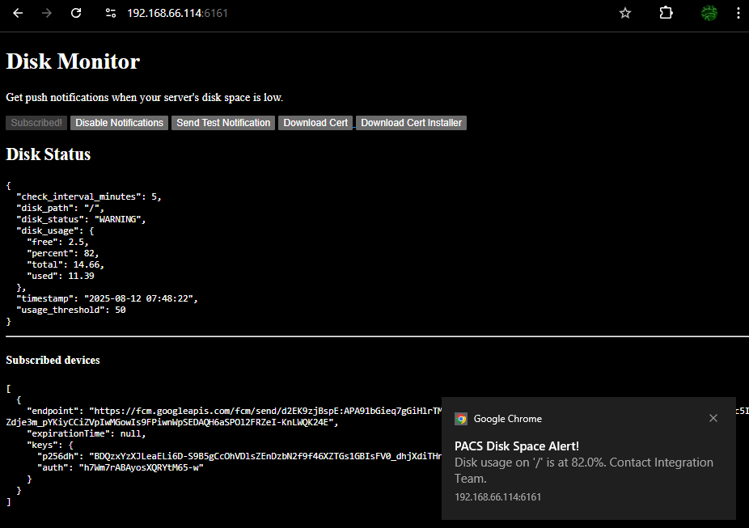

# disk-monitor
simple flask webserver designed to run in restricted hospital lab servers and warn users in the same network with a web-push notification if the specified disk usage is above a threshold.

## goal
the project is designed to run standalone on old* ubuntu servers with no internet connection to outside. it requires the clients to install the generated `cert.pem` to their machine in order for `service-worker.js` subscriptions to work. the user must manually subscribe to the disk-monitor notification signal from the generated website. helper scripts are also served on the generated website.

#### development:
 - to activate this python environment: `source venv/bin/activate`
 - run the dev server: `python3 app.py`
 - pack into a single executable with: `pyinstaller --onefile --add-data="templates:templates" --add-data="static:static" app.py`
 make sure you are not using old certs. 

### Releases
experimental project. not recommended for production environment.

[https://github.com/clod44/disk_monitor/releases](https://github.com/clod44/disk_monitor/releases)

